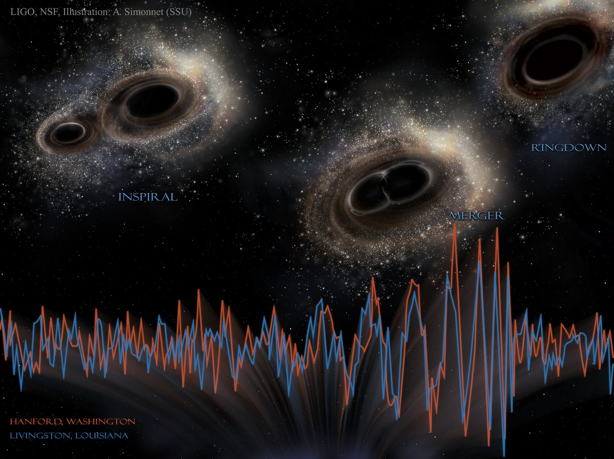
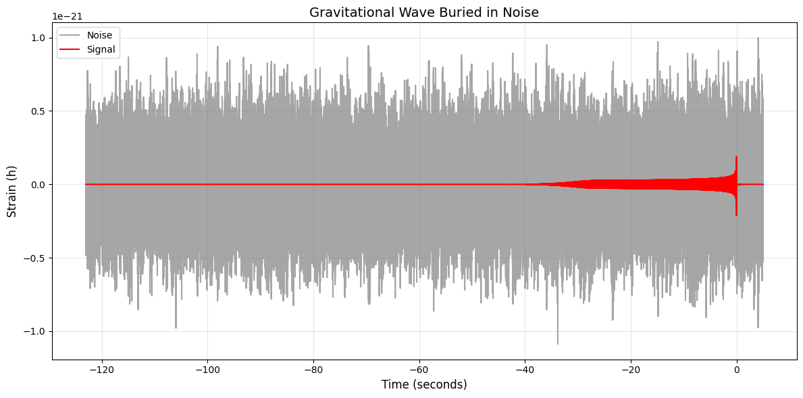
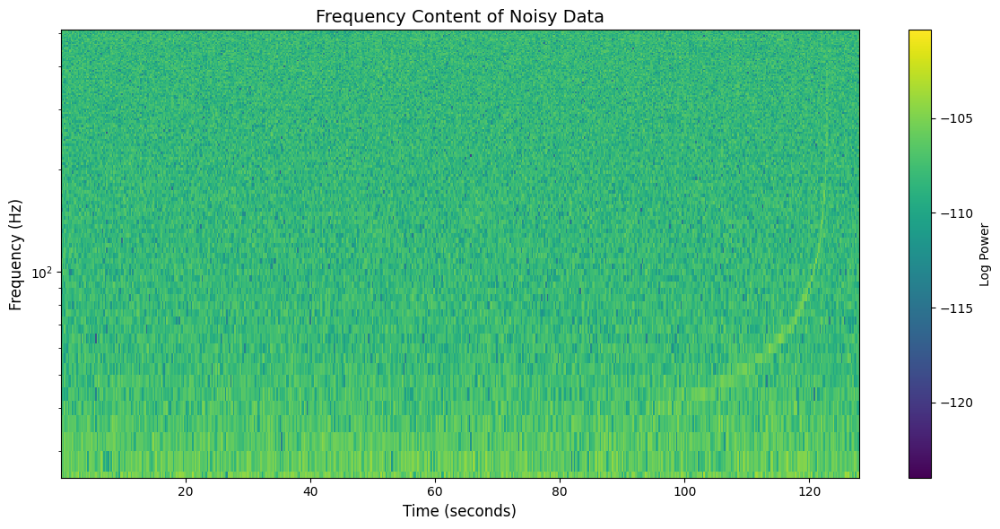
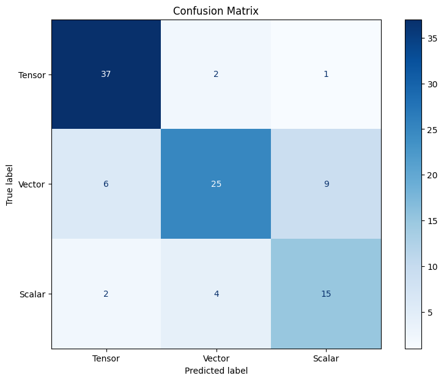

# Gravitational Wave Polarization Research

This project uses **Bayesian statistics** and **machine learning** to classify simulated gravitational wave signals into three polarization modes, based on predictions from different theories of gravity.

The **Bayes factors** (logarithmic values) between polarization mode models, derived from waveform simulated data, are used as the features for the machine learning models. Logistic regression and random forest training are done, obtaining prediction models with accuracies of 70%~80%.

$$
\log K = \log\frac{P(D \mid M_1)}{P(D \mid M_2)}
  = \log\frac{\displaystyle \int p(D \mid \theta_1, M_1)\, p(\theta_1 \mid M_1)\, d\theta_1}
         {\displaystyle \int p(D \mid \theta_2, M_2)\, p(\theta_2 \mid M_2)\, d\theta_2}
$$

---

### **Scientific Context**  
Gravitational waves are ripples in spacetime caused by massive accelerating objects like merging neutron stars. LIGO detects these waves using laser interferometry. This project uses a binary neutron star merger signal from LIGO, adds realistic detector noise, and demonstrates signal processing techniques to identify the "chirp" waveform. The "chirp" is the rise in frequency which is a telltale proof of a gravitational wave signal.

While general relativity only permits tensor modes, some alternative theories predict additional polarizations. Generic metric theories of gravity allow the existence of six gravitational wave polarization states which can be categorized into tensor modes, vector modes and scalar modes. Searching for non-tensorial polarization modes is a direct test of General Relativity's validity. 

Since the _prior_ probability of each polarization as the truth is arbitrary, the _Bayes factor_ is used as the comparison of strength of evidence between two models given a set of measured signal. 

## Project Structure
*   **`Gravitational wave data chirp detection.ipynb`:**  A Jupyter Notebook containing the LIGO data loading, g-wave waveform generation, noise generation, data processing, analysis and signal visualization.
*   **`machine learning gw polarization.ipynb`:**  The main Jupyter Notebook containing the g-wave simulation result data loading, preprocessing, model training, and evaluation.
*   **`tsummary.txt`, `vsummary.txt`, `ssummary.txt`:**  Input data files (CSV format).  These files contain the simulation results for tensor, vector, and scalar polarizations, respectively.  Each file includes signal parameters ,Right Ascension (RA), Declination (Dec), Signal-to-Noise Ratio (SNR), Bayesian evidences (logZ) for different polarization models, and other relevant information.
*   **`README.md`:** This file, providing an overview of the project.
*   **`requirements.txt`:** A list of Python packages required to run the notebook.
*   **`research presentation.pdf`:** Physics-focused presentation slides for this research project.

## Gravitational wave data chirp detection

`Gravitational wave data chirp detection.ipynb` simulates the detection of a gravitational wave signal from a binary neutron star (BNS) merger by a LIGO-like detector. It contains key aspects of gravitational wave data analysis, including:

*   Generating a "chirp" signal using a theoretical waveform model (PyCBC).
*   Simulating the detector's response to the gravitational wave, including its directional sensitivity, with realistic detector noise.
*   Applying signal processing techniques (whitening, FFT and spectrogram generation) to reveal the characteristic chirp signal buried within the noise.

## Polarization classification with machine learning

`machine learning gw polarization.ipynb` begins by loading three separate datasets, one for each polarization type (tensor, vector, and scalar). They are the output of BANTAM (BAyesian Null sTreAM): A pipeline designed for null
stream analysis. Each dataset is expected to have the following information:

*   Signal parameters (RA, Dec, SNR)
*   Bayesian evidences (logZ) for various polarization models e.g., `logZ-tensor-N-0`, `logZ-vector-R-1`, etc. (N/P/R followed by a number represents approximation done to match the degrees of freedom in
antenna response functions. N: Normal, R: Reduced, P: Promoted degrees of freedom)
*   Localization information (though not explicitly used in the provided code snippet)

The datasets undergo the following preprocessing steps:

1.  **Encoding:**  Each dataset is labeled with its corresponding polarization type: 0 for tensor, 1 for vector, and 2 for scalar.  This creates the target variable for the classification task.
2.  **Data Cleaning:** Rows with missing values (`NaN`) are removed to ensure data quality.
3.  **Concatenation:** The three datasets are combined into a single DataFrame. The combined dataset is shuffled to randomize the order of data points, which is important for training machine learning models.
4.  **SNR Filtering:** Events with a Signal-to-Noise Ratio (SNR) below 8 are removed.  This threshold is commonly used in gravitational-wave data analysis to select events with clear, detectable signals.
5.  **Feature Engineering:** Key features are created by taking the *differences* between the `logZ` values of different polarization models, i.e. the _Bayes factor_ log K.  These differences represent the relative likelihood of one model being true compared to another (e.g., `btnvn = logZ-tensor-N-0 - logZ-vector-N-0`). The original `snr` is included as it affects how reliable a signal is. This creates features that are physically meaningful and directly related to the model selection process.  The following features are generated:
    *   `btnvn`: Bayes factor between tensor (normal) and vector (normal) models.
    *   `btrvr`: Bayes factor between tensor (reduced) and vector (reduced) models.
    *   `btrsn`: Bayes factor between tensor (reduced) and scalar (normal) models.
    *   `btnsp`: Bayes factor between tensor (normal) and scalar (promoted) models.
    *   `bvrsn`: Bayes factor between vector (reduced) and scalar (normal) models.
    *   `bvnsp`: Bayes factor between vector (normal) and scalar (promoted) models.
    * `snr`: The signal to noise ratio.

(Degrees of freedom, N: Normal, R: Reduced, P: Promoted ) 

## Machine Learning Models

The notebook uses two classification models: **Logistic Regression** and **Random Forest**

For each model, the following steps are performed:

1.  **Data Splitting:** The preprocessed dataset is split into training and testing sets using `train_test_split` from scikit-learn.  This allows for evaluating the model's performance on unseen data.
2.  **Feature Scaling:** The features are scaled using `StandardScaler` to have zero mean and unit variance.  This is crucial for models like logistic regression that are sensitive to feature scaling.
3.  **Model Training:** The model is trained on the training data.
4.  **Model Evaluation:** The trained model's performance is evaluated on the testing data.  The accuracy and the confusion matrix are reported
    *   Accuracy: The proportion of correctly classified instances.
    *   Confusion Matrix: A table showing the counts of true positive, true negative, false positive, and false negative predictions.

Accuracy random forest trained model: 76%

Confusion matrix of random forest trained model:

